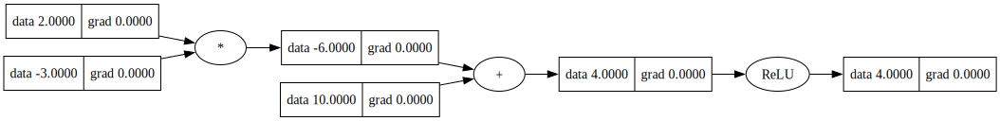

# nanograd

Minimal, clean automatic differentiation and tiny neural nets in Python. Heavily inspired by Andrej Karpathy's [micrograd](https://github.com/karpathy/micrograd) implementation.

This implementation was strictly for educational purposes, but nanograd can be used as a simple and interpretable learning library. Production-grade network training and inference should be done with a deep learning framework, like [JAX](https://github.com/ayushgun/learn-jax).

## Example

Train a tiny MLP with ReLU hidden layers using SGD:

```python
from nanograd.nn import MLP, SGDOptimizer

# Toy 3D to 1D dataset with targets in {-1, 1}
X = [
    [2.0, 3.0, -1.0],
    [3.0, -1.0, 0.5],
    [0.5, 1.0, 1.0],
    [1.0, 1.0, -1.0],
]
Y = [1.0, -1.0, -1.0, 1.0]

model = MLP(n_in=3, n_outs=[4, 4, 1])
opt = SGDOptimizer(model.parameters(), lr=0.05)

for _ in range(100):
    # Forward pass: compute predictions for all samples
    y_pred = [model(x) for x in X]
    loss = sum((yp - y) ** 2 for yp, y in zip(y_pred, Y))

    # Backward pass: compute gradients
    model.zero_grad()
    loss.backward()

    # Update model parameters with SGD
    opt.step()

print("Loss:", loss.data)
print("Preds:", [p.data for p in y_pred])
```

## Tracing

Visualize the computation graph for any `Scalar` via `Scalar.draw()`.

```python
from nanograd.grad import Scalar

a = Scalar(2.0)
b = Scalar(-3.0)
c = Scalar(10.0)
e = a * b
d = e + c
f = d.relu()
dot = f.draw()
dot.render("docs/trace", format="svg", cleanup=True)
```

Rendered example:


